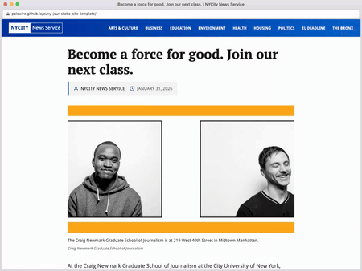

A simple SvelteKit starter template for ["JOUR 73361: Coding the News,"](https://github.com/palewire/cuny-jour-73361-coding-the-news) a course taught at the City University of New York's Craig Newmark Graduate School of Journalism



## Quick Start

1. Click the green "Use this template" button on GitHub
2. Clone your new repository to your computer
3. Open the project in VS Code
4. Open a terminal and run:

```bash
npm install
npm run dev
```

5. Open http://localhost:5173 in your browser
6. Edit `src/routes/+page.svelte` to customize your page

### Deployment

Your site will automatically deploy to GitHub Pages when you push to the `main` branch. To enable this:

1. Go to your repository **Settings** > **Pages**
2. Under "Source", select **GitHub Actions**

That's it! Every push to `main` will automatically build and deploy your site to `https://<your-github-username>.github.io/<your-repository-name>/`

## Documentation

This template includes a [Storybook](https://storybook.js.org/) documentation app that demonstrates every component and the core SvelteKit patterns used in this project.

It is published alongside the main site at [palewire.github.io/cuny-jour-static-site-template/storybook/](https://palewire.github.io/cuny-jour-static-site-template/storybook/).

When you make a page based on the storybook will publish at `https://<your-github-username>.github.io/<your-repository-name>/storybook/`

### Run Storybook locally

```bash
npm run storybook
```
